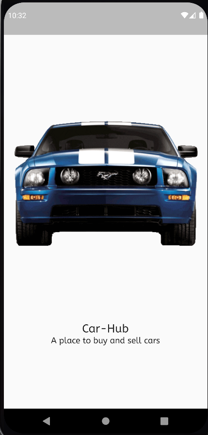
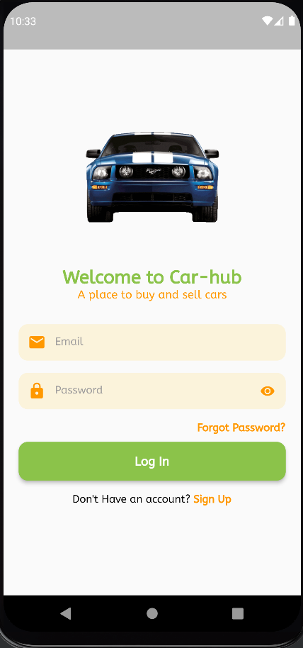

# CarHub: Revolutionizing Car Buying and Selling

Welcome to CarHub, your ultimate destination for a modern and seamless car buying and selling experience. We've created an innovative platform that connects car enthusiasts, sellers, and buyers in an intuitive and efficient way. With a focus on user-friendliness and cutting-edge technology, CarHub is here to redefine the automotive marketplace.

## Features

- **Buying and Selling Made Easy:** CarHub offers a dynamic marketplace where users can effortlessly buy or sell their vehicles. Sellers can create detailed listings with vehicle information, images, and specifications. Buyers can explore an extensive collection of cars, apply advanced filters, and directly communicate with sellers.

- **Favourite Section:** Keep track of your preferred vehicles by adding them to your favorites. Never lose sight of the cars that caught your eye, making your decision-making process even more convenient.

- **User-Friendly Interface:** Our user interface is designed with simplicity in mind. Navigating through car listings, communicating with sellers, and managing your account are intuitive and hassle-free.

## Tools and Technologies

- ** Android Studio:** The application is built using Android Studio, the official integrated development environment for Android app development.

- ** Firebase:** We utilize Firebase for real-time database management, user authentication, and cloud storage. This ensures smooth user interactions and data management.

- ** Figma:** Our design process involves Figma, a collaborative interface design tool. This enables us to create visually appealing and user-centric interfaces.

- ** Visual Studio Code:** The codebase is crafted and maintained using Visual Studio Code, a lightweight yet powerful code editor.

- ** Git and  GitHub:** We follow a collaborative approach to development with Git version control and GitHub for code hosting. This ensures seamless teamwork and efficient code management.

## MVVM Pattern

CarHub follows the MVVM (Model-View-ViewModel) architectural pattern to separate the application's concerns and enhance maintainability. This pattern ensures clear separation between the user interface, business logic, and data handling.

## Get Started

1. Clone this repository using:
   ```bash
   git clone https://github.com/nwj002/Car-Hub
   

## ui Screenshorts




